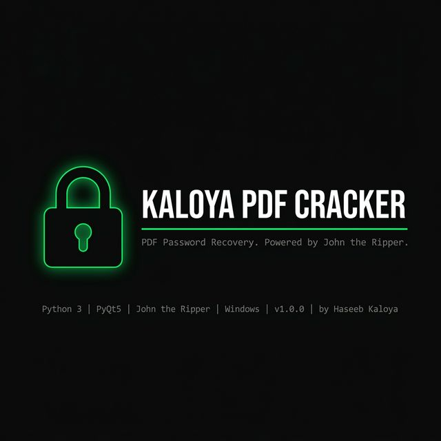
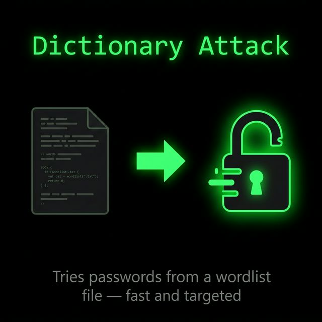
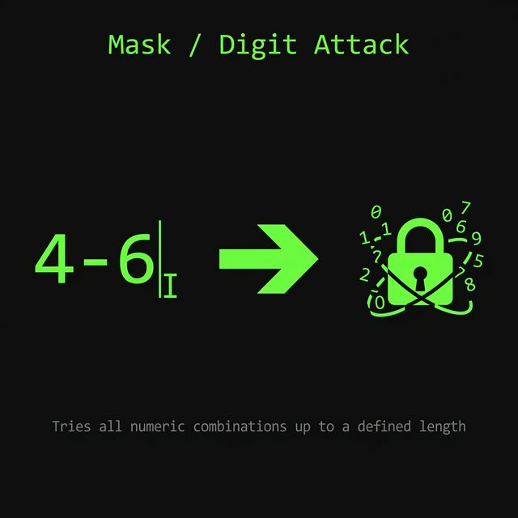

<div align="center">



[](https://github.com/haseebkaloya/kaloya-pdf-cracker/releases)
[](https://www.python.org)
[](LICENSE)
[](https://github.com/haseebkaloya/kaloya-pdf-cracker/releases)
[](https://github.com/haseebkaloya/kaloya-pdf-cracker/stargazers)

</div>

---

## Overview

Kaloya PDF Cracker is a professional-grade PDF password recovery tool for Windows. It provides two distinct attack modes — dictionary-based and numeric mask — through a purpose-built graphical interface that stays responsive throughout the entire cracking process.

The tool does not implement its own cryptographic engine. Instead, it wraps **John the Ripper**, a well-established open-source password security auditing tool, so every attack runs at native binary speed. PDF hash extraction is handled by the **pyhanko** library, which reliably reads the encryption metadata from standard and legacy PDF security handlers.

This is not a script. It is a deployable desktop application, built for Windows, distributed with a proper installer and no external dependencies required.

---

## Demo

> Record your own walkthrough and add it here. To embed a screen recording: record your session, drag-and-drop the file into a GitHub Issue comment box to upload it, copy the resulting URL, then embed it below.

<!-- REPLACE THIS BLOCK WITH YOUR RECORDING URL -->
<!--  -->

*Screen recording coming soon.*

---

## Features

| Feature | Details |
|---|---|
| Dictionary Attack | Supply any `.txt` wordlist; the engine tests each candidate at hardware speed |
| Mask / Digit Attack | Define a digit-length range (e.g. `4-6`); the tool iterates all numeric combinations |
| Automatic Hash Extraction | Reads the PDF encryption header directly, no manual hash preparation required |
| Algorithm Detection | Identifies and reports RC4-40, RC4-128, AES-128, or AES-256 encryption |
| Live Terminal Output | All backend activity streams in real time to the built-in GUI console |
| Non-blocking UI | The cracking engine runs in a dedicated thread; the interface stays fully interactive |
| Cross-generation JtR | Ships with AVX2, AVX, SSE4.1, SSE2, and generic JtR builds; best binary selected automatically |
| Abort Control | The "ABORT ATTACK" button terminates the backend cleanly at any point |
| Windows Integration | Dark title bar, custom application icon, Start Menu and Desktop shortcuts via installer |

---

## Requirements

| Requirement | Minimum |
|---|---|
| Operating System | Windows 10 (64-bit) or Windows 11 |
| Python | 3.9 or later (only for "run from source") |
| Disk Space | ~120 MB (installed) |
| RAM | 512 MB available |
| Dependencies | PyQt5, pyhanko (run from source only) |

---

## Installation

### Option A — Download the Installer (Recommended)

1. Go to the [Releases page](https://github.com/haseebkaloya/kaloya-pdf-cracker/releases).
2. Download **`KaloyaPDFCracker_Setup_v1.0.0.exe`**.
3. Run the installer and follow the setup wizard.
4. Launch **Kaloya PDF Cracker** from the Desktop or Start Menu.

No Python installation required. All dependencies are bundled.

---

### Option B — Run from Source

**Prerequisites:** Python 3.9+, pip

```powershell
# 1. Clone the repository
git clone https://github.com/haseebkaloya/kaloya-pdf-cracker.git
cd kaloya-pdf-cracker

# 2. Install dependencies
pip install PyQt5 pyhanko

# 3. Launch the application
python main.py
```

---

## Usage

### Step 1 — Select a Target

Click **BROWSE** in the *Target Selection* panel and choose a password-protected PDF file.

### Step 2 — Choose an Attack Mode

**Dictionary Attack**

Select **Dictionary Attack (File)**, then browse for a wordlist (`.txt` file, one password per line). This method is effective when the password is a common word or phrase.

```
Example wordlist path: C:\wordlists\rockyou.txt
```

**Digit / Mask Attack**

Select **Dynamic Digits (Mask)**, then enter a length or range in the *Length* field.

```
Single length:  6        (tries all 6-digit numbers: 000000 to 999999)
Range:          4-6      (tries all 4-digit, then 5-digit, then 6-digit numbers)
```

### Step 3 — Initiate the Attack

Click **INITIATE CRACK**. The button changes to **ABORT ATTACK** and the backend starts immediately. Output streams to the terminal area in real time.

### Step 4 — Review the Result

If the password is found, a popup displays the plaintext password and the time taken. Click **ACKNOWLEDGE** to dismiss. The result is also written to a `result.txt` file in the application directory.

If the attack is exhausted without a result, the panel reports failure along with the total time elapsed.

---

## Attack Modes — Explained

### Dictionary Attack



The dictionary engine passes a wordlist directly to John the Ripper via the `--wordlist` flag. John reads and tests each line against the PDF hash at native speed. This approach is the fastest route to success when the password is a proper word, phrase, or known leaked credential.

Recommended public wordlists: `rockyou.txt` (~14M entries), `SecLists` collections, or domain-specific lists.

### Mask / Digit Attack



The mask engine uses John the Ripper's `--mask=?d?d...` feature to systematically enumerate all numeric combinations up to the specified digit length. A range of `4-6` runs three sequential sub-attacks: all 4-digit, all 5-digit, and all 6-digit PINs. The current digit length is reported in the terminal on each transition.

---

## File Structure

```
kaloya-pdf-cracker/
├── main.py                  # Application entry point
├── cracker.py               # Core cracking engine and hash extraction
├── build.bat                # One-click PyInstaller build script
├── build.spec               # PyInstaller configuration
├── DISCLAIMER.txt           # License and legal disclaimer
├── LICENSE                  # MIT License
│
├── gui/
│   ├── main_window.py       # PyQt5 main window and UI logic
│   ├── worker.py            # Background QThread cracker worker
│   ├── styles.qss           # Application stylesheet
│   ├── logo.ico             # Application icon
│   └── logo.png             # Logo image (sidebar)
│
├── john/
│   └── run/                 # John the Ripper binaries and config files
│
├── installer/
│   ├── setup.iss            # Inno Setup installer script
│   ├── wizard_sidebar.png   # Installer sidebar image
│   └── wizard_header.png    # Installer header image
│
├── docs/
│   ├── TECHNICAL.md         # Architecture and implementation details
│   ├── WORDLIST_GUIDE.md    # Guide to finding and using wordlists
│   ├── images/              # README images and banners
│   └── icons/               # SVG icons
```

---

## Known Limitations

- **Windows only.** The bundled John the Ripper binaries are compiled for 64-bit Windows. Running from source on Linux or macOS would require a separately compiled JtR binary and path adjustments in `cracker.py`.
- **Numeric masks only (GUI).** The GUI exposes digit-only brute-force. For alpha or custom masks, run `cracker.py` directly from the command line with the `--wordlist` or `--digits` flag.
- **PDF revision 6 (AES-256-R6).** John the Ripper's PDF format supports this revision, but performance is significantly slower than RC4 or AES-128 due to the key derivation cost.
- **No GPU acceleration in this build.** The bundled JtR is the CPU build. OpenCL/CUDA builds exist upstream and can be substituted manually by replacing the appropriate executable in `john/run/`.

---

## Roadmap

| Feature | Status |
|---|---|
| Alpha/alphanumeric mask support via GUI | Planned |
| Progress percentage and estimated time remaining | Planned |
| Multi-PDF batch mode | Under consideration |
| GPU acceleration (OpenCL build) | Under consideration |
| Linux/macOS source support | Under consideration |


---

## License

This project is licensed under the MIT License. See [LICENSE](LICENSE) for details.

The bundled John the Ripper binaries are distributed under their own license. See [john/README.md](john/README.md) for the upstream project information.

---

## Contact

**Developer:** Haseeb Kaloya
**Email:** haseebkaloya@gmail.com
**GitHub:** [github.com/haseebkaloya](https://github.com/haseebkaloya)
**LinkedIn:** [linkedin.com/in/haseeb-kaloya-872194329](https://www.linkedin.com/in/haseeb-kaloya-872194329)
